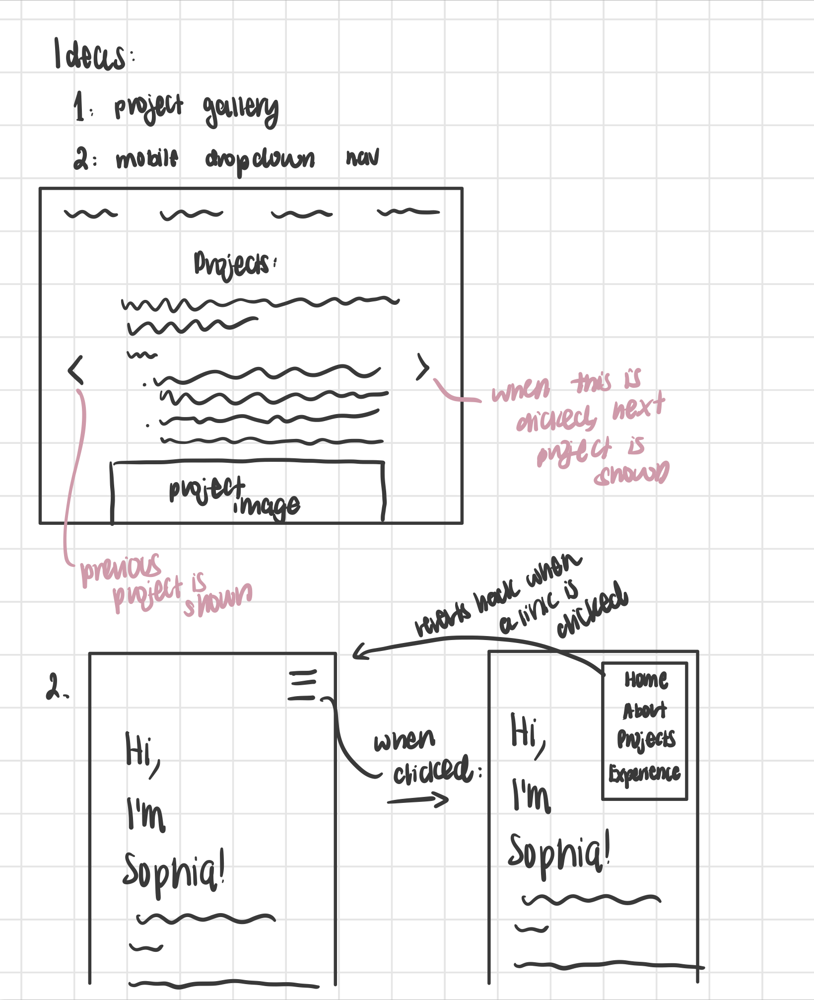
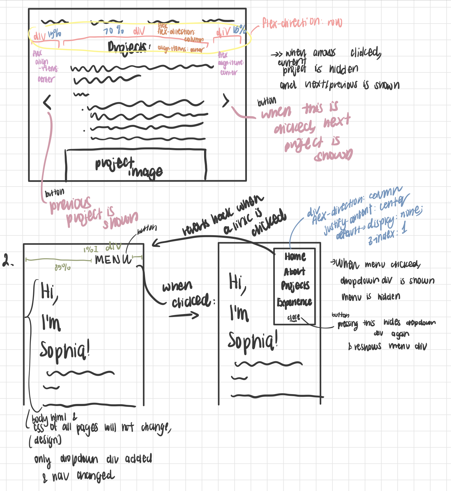
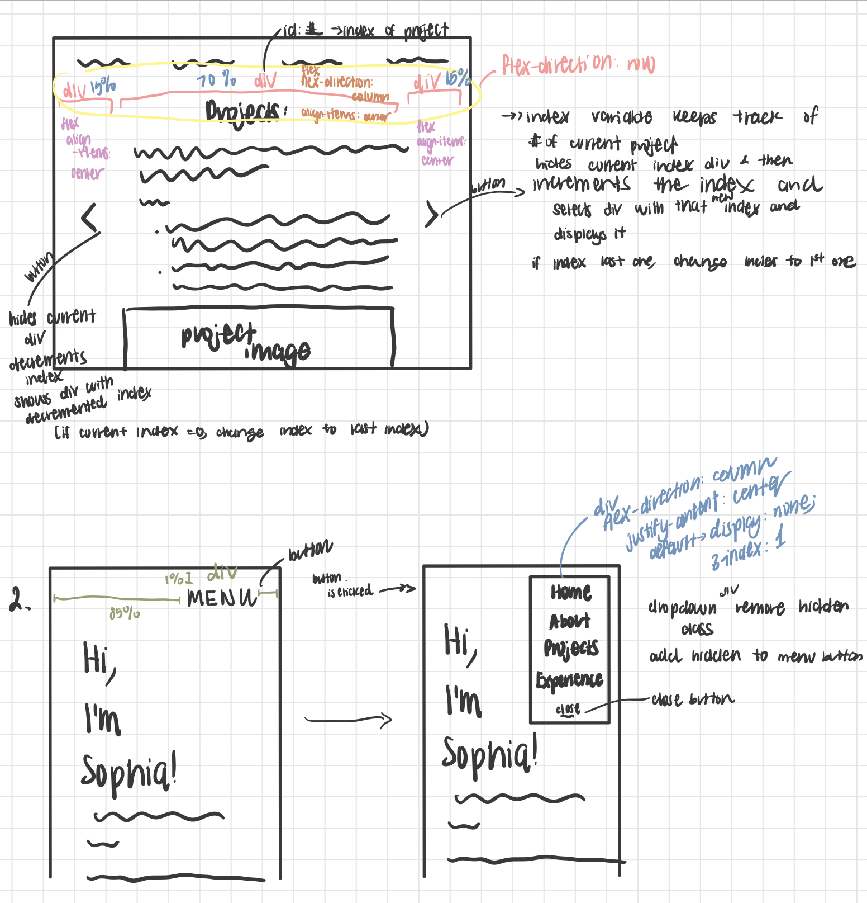

# Project 3: Design Journey

**For each milestone, complete only the sections that are labeled with that milestone.** Refine all sections before the final submission.

You are graded on your design process. If you later need to update your plan, **please do not delete the original plan, leave it in place and append your new plan _below_ the original.** Then explain why you are changing your plan. Any time you update your plan, you're documenting your design process!

**Replace ALL _TODOs_ with your work.** (There should be no TODOs in the final submission.)

Be clear and concise in your writing. Bullets points are encouraged.

**Everything, including images, must be visible in _Markdown: Open Preview_.** If it's not visible in the Markdown preview, then we can't grade it. We also can't give you partial credit either. **Please make sure your design journey should is easy to read for the grader;** in Markdown preview the question _and_ answer should have a blank line between them.


## Existing Project (Milestone 1)

**Tell us about the project you'll be using for Project 3.**

### Project (Milestone 1)
> Which project will you add interactivity to enhance the site's functionality?

Project 1


### Audience (Milestone 1)
> Briefly explain your site's audience.
> Be specific and justify why this audience is a **cohesive** group.

The intended audience for my site is recruiters in the technology industry who are looking to hire me for an internship, or, in the future, for a full-time job as a software engineer/developer. This audience matches my site's topic, as this is a personal site that is meant to suplement my resume with more information about myself and more personality. It is an informational but fun and visually appealing site that is perfect for future employers looking to find more information about my technical experience and education background that isn't present in my resume. This audience is a cohesive group, because it is a group of people with similar goals for using this website, so each person in the audience's wants and needs should be addressed cohesively by this site.


### Audience's Goals (Milestone 1)
> List the audience's goals that you identified in Project 1 or 2.
> Simply list each goal. No need to include the "Design Ideas and Choices", etc.
> You may adjust the goals if necessary.

- To get more elaborated information about my work experience/technical background
- To visually learn about my experience through image supplements
- To learn more about me beyond my technical experience

## Interactivity Design (Milestone 1)

### Interactivity Brainstorm (Milestone 1)
> Using the audience goals you identified, brainstorm possible options for interactivity to enhance the functionality of the site while also assisting the audience with their goals.
> Briefly explain each idea and provide a brief rationale for how the interactivity enhances the site's functionality for the audience.
> Note: You may find it easier to sketch for brainstorming. That's fine too. Do whatever you need to do to explore your ideas.

- a gallery for the projects page (minimize scrolling, etc): makes it easier for users to quickly visualize all past projects without having to scroll a lot to see them
- a vertical dropdown for mobile users: so that they can more easily access the different pages without needing to horizontally scroll on the nav bar or so that the design of the nav is more visually appealing


### Interactivity Design Ideation (Milestone 1)
> Explore the possible design solutions for the interactivity.
> Sketch several iterations of your interactivity.
> Annotate each sketch explaining what happens when a user takes an action. (e.g. When user clicks this, something else appears.)




### Final Interactivity Design (Milestone 1)
> Create _polished_ sketch(es) (it's still a sketch, but with a little more care taken to communicate ideas clearly to the graders) to plan your interactivity.
> **Sketch out the entire page where your interactivity will go.**
> Include your interactivity to the sketch(es).
> Add annotations to explain what happens when the user takes an action.
> Include as many sketches as necessary to communicate your design (ask yourself, could another 1300 take these sketches an implement my design?)




### Interactivity Rationale (Milestone 1)
> Describe the purpose of your proposed interactivity.
> Provide a brief rationale explaining how your proposed interactivity addresses the goals of your site's audience.
> This should be about a paragraph. (3-5 sentences)

The rationale of the first idea (the gallery) is that the gallery makes it a lot easier for members of the audience to view projects faster and in a more concise and compact way. This way, each gallery element allows the viewer to just focus on that one element and it is easier to navigate between elements (button not scroll).

The rationale of the second idea (dropdown) is that this makes the nav bar much easier to use. Instead of doing horizontal scroll on mobile or having a vertical nav bar constantly taking up space at the top, we can use a dropdown. This way, it doesn't take up uncessary space and the top of the page when it's not needed. This also allows users to more easily focus on the main page's content right away.


## Interactivity Implementation Plan (Milestone 1)

### Interactivity Planning Sketches (Milestone 1)
> Produce planning sketches that include all the details another 1300 student would need to implement your interactivity design.




### Interactivity Pseudocode Plan (Milestone 1)
> Write your interactivity pseudocode plan here.
> Pseudocode is not JavaScript. Please do not put JavaScript code here.

for idea 1: gallery

```
index = 0 on default (numbered from 0 to number of divs - 1)

when next button (>) clicked {
    select div #index and addClass hidden
    if (index == lastIndex) {
        index = 0
    } else {
        index++
    }
    select div #index and removeClass hidden
}

when previous (<) button clicked {
    select div #index and addClass hidden
    if (index == 0) {
        index = lastIndex
    } else {
        index--
    }
    select div #index and removeClass hidden
}
```

for idea 2: dropdown

```
if menu button clicked {
    menu add class hidden
    dropdown remove class hidden
}

if close button clicked {
    dropdown add class hidden
    menu remove class hidden
}
```


### "Ambitious" Interactivity Explanation (Milestone 1)
> In your own words, concisely explain why you believe your interactivity meets the "ambitious" requirement.
> This should be a few sentences. (1-3 sentences)

I believe my interactivity meets the ambitious requirement, as the interactive components are included in the list of possible ambitious interactive components.


## Grading (Final Submission)

### Interactivity Usability Justification (Final Submission)
> Explain how your design effectively uses affordances, visibility, feedback, and familiarity.
> Write a large paragraph (4-6 sentences)

My design effectively uses affordances, as I have menu and close buttons, and < for previous slide and > for next slide. My design uses visibility, as with the dropdown, the menu button is hidden when it is pressed and the dropdown and close button are shown. Also with the gallery, divs are hidden and shown when the previous or next buttons are pressed. My design also uses feedback as the information and picture of the gallery change and the dropdown appears. The design also uses familiarity because the dropdown is familiarly labeled and the gallery uses familar arrows that correspond to left and right.


### Tell Us What to Grade (Final Submission)
> We aren't re-grading your Project 1 or 2.
> We are only grading the interactivity you added.
> Tell us where (what pages) we can find your interactivity and how to use it.
> **We will only grade what you list here;** if it's not listed, we won't grade it.

any of the page's nav bars and the gallery on the projects page


### Collaborators (Final Submission)
> List any persons you collaborated with on this project.

n/a


### Reference Resources (Final Submission)
> Please cite any external resources you referenced in the creation of your project.
> (i.e. W3Schools, StackOverflow, Mozilla, etc.)

StackOverflow, snippets, Mozilla


### Self-Reflection (Final Submission)
> This was the first project in this class where you coded some JavaScript. What did you learn from this experience?

I learned about the JQuery syntax and how to use it instead of using document.querySelector.


> Take some time here to reflect on how much you've learned since you started this class. It's often easy to ignore our own progress. Take a moment and think about your accomplishments in this class. Hopefully you'll recognize that you've accomplished a lot and that you should be very proud of those accomplishments!

Reflection: learned a lot about different html elements and css properties that exist and about jquery!
